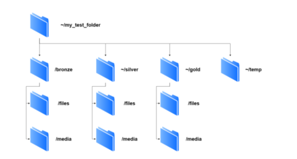

<h1>ПРАКТИКА №1. НАСТРОЙКА И ИСПОЛЬЗОВАНИЕ ОС
LINUX В КАЧЕСТВЕ ФАЙЛОВОЙ СИСТЕМЫ</h1>

<h3>Задание 1</h3>

<p>Развернуть операционную систему Ubuntu Linux Server 18.04 с
помощью средства для виртуализации ОС на персональном
компьютере. Разрешено как использовать готовый образ ОС по
ссылке, так и вручную настроить серверную операционную систему
с нуля. Войти в ОС Linux под созданной учетной записью
пользователя (в случае с готовым образом системы
пользователь/логин: user, пароль: user).</p>

<h3>Решение</h3>

<p>Используемая в рамках данной работы система виртуализации: Oracle
VirtualBox, которую можно получить по ссылке: https://www.virtualbox.org/.
Загрузим VirtualBox с сайта перейдя во вкладку downloads.
<br>Для продолжения практики необходимо скачать файл с конфигурацией
серверной операционной системы на свой компьютер с диска:
https://disk.yandex.ru/d/oe6INm5yyRn1Xw. Это настроенный образ системы,
который вы сможете импортировать в VirtualBox</p>

<h3>Задание 2</h3>

<p>Получить справку по команде top. С помощью команды top
просмотреть занимаемое операционной системой место в
оперативной памяти. Выйдите из выполнения команды top в
терминале.</p>

<h3>Решение</h3>

````  bash
 top -h
 top
 q
````
<h3>Задание 3</h3>

<p>Просмотреть путь к текущей директории. Создать в
пользовательской директории папку для самостоятельной работы
цифры_шифра/my_test_folder. Внутри нее создать директории в
связи со следующей структурой:</p>



<p>Вывести на экран всю созданную древовидную структуру в виде
списка папок и подпапок в терминал командной строки.
Перевести вывод созданной структуры в файл
~/my_test_folder/temp/dirs.txt.</p>


<h3>Решение</h3>

````  bash
 pwd
 mkdir -p ~/my_test_folder
 mkdir -p ~/my_test_folder/bronze/files
 mkdir -p ~/my_test_folder/bronze/media
 mkdir -p ~/my_test_folder/silver/files
 mkdir -p ~/my_test_folder/silver/media
 mkdir -p ~/my_test_folder/gold/files
 mkdir -p ~/my_test_folder/gold/media
 mkdir -p ~/my_test_folder/temp
 tree  > my_test_folder/temp/dirs.txt
````

<h3>Задание 4</h3>

<p>Перейти в папку /my_test_folder/temp. Создайте в папке пустой файл
test.txt. Ввести в файл информацию «Hello, its my first file in Linux!».
Вывести сообщение из файла в консоль. Просмотрите размер
созданного файла.</p>

<h3>Решение</h3>

````  bash
 cd my_test_folder/temp
 touch test.txt
 echo "Hello, its my first file in Linux!" > test.txt
 cat test.txt
 ls -l test.txt
````

<h3>Задание 5</h3>

<p>С помощью команды wget загрузить в папку temp файл архива
https://github.com/qwerty29544/BigDataEssentials/raw/main/Practice1_
LinuxCommands/data.tar.gz с данными для выполнения дальнейших
пунктов практической работы. Разархивировать файлы в папку
temp, не создавая новых каталогов. Просмотрите список файлов и
их уровней доступа.</p>

<h3>Решение</h3>

````  bash
 wget https://github.com/qwerty29544/BigDataEssentials/raw/main/Practice1_LinuxCommands/data.tar.gz -P temp
 tar xf temp/data.tar.gz
 cd data
 ls -l
````

<h3>Задание 6</h3>

<p>Перенесите все файлы изображений (расширения .eps, .png, .jpg) в
папку /bronze/media. Выведите список файлов в данной директории
продемонстрируйте количество занимаемого места на диске
данными файлами, а также список прав на доступ к файлу.
Переименуйте изображение герба РТУ МИРЭА в MIREA_gerb_rgb.* </p>

<h3>Решение</h3>

````  bash
 find . -type f \( -iname "*.eps" -o -iname "*.png" -o -iname "*.jpg" \) -exec mv {} ./bronze/media
 ls -l /bronze/media
 mv /bronze/media/{"Название файла с гербами"}.* /bronze/media/MIREA_gerb_rgb.*
````
<h3>Задание 7</h3>

<p>Выведите в терминал первые строки из файлов изображений.
Покажите какой формат изображений выводит информацию в
структурированном виде. Чем визуально различаются префиксы во
всех форматах файлов изображений.</p>

<h3>Решение</h3>

````  bash
 head -n 5 ./bronze/media/*.{eps,png,jpg}
````
<h3>Задание 8</h3>

<p>Перенести файлы форматов .txt, .TXT, .csv, .db в папку /bronze/files.
Для файла TNVED1.TXT выведите первые его строки. Проверьте
кодировку файла TNVED1.TXT с помощью команды file. Создайте
новый файл с именем tnved1_utf.txt переведя кодировку файла
TNVED1.TXT из кодировки CP866 в кодировку UTF-8. Выведите
ещё раз содержимое файла в терминал. Проделайте то же самое с
файлами TNVED2 и TNVED3. Перенесите файлы в читаемой новой
кодировке в папку /silver/files.</p>

<h3>Решение</h3>

````  bash
 find . -type f \( -iname "*.txt" -o -iname "*.TXT" -o -iname "*.csv" -o -iname "*.db" \) -exec mv {} ./bronze/files \;
 head -n 5 ./bronze/files/TNVED1.TXT
 file /bronze/files/TNVED1.TXT
 iconv -f CP866 -t UTF-8 ./bronze/files/TNVED1.TXT > /bronze/files/tnved1_utf.txt
 head -n 5 /bronze/files/tnved1_utf.txt
 iconv -f CP866 -t UTF-8 /bronze/files/TNVED2.TXT > /bronze/files/tnved2_utf.txt
 iconv -f CP866 -t UTF-8 /bronze/files/TNVED3.TXT > /bronze/files/tnved3_utf.txt
 mv /bronze/files/tnved1_utf.txt /silver/files
 mv /bronze/files/tnved2_utf.txt /silver/files
 mv /bronze/files/tnved3_utf.txt /silver/files
````


<h3>Задание 9</h3>

<p>В полученных файлах tnved*_utf.txt с помощью редактора nano
заменить прямые разделители «|» на двойные «||» во всем тексте.
Выведите содержимое на экран терминала. Переместите данные
файлы далее в каталог /gold/files. Вывести итоговый результат
работы в виде дерева каталога /my_test_folder </p>

<h3>Решение</h3>

````  bash
 find /silver/files -type f -name "tnved*_utf.txt" -exec sed -i 's/|/||/g' {} \;
 head -n 5 /silver/files/tnved*_utf.txt
 mv /silver/files/tnved*_utf.txt /gold/files
 tree
````

<h3>Задание 10</h3>

<p>Запустить PostgreSQL на виртуальной машине посредством
соединения с командной строкой и ssh. Проверить наличие таблиц с данными
в БД.</p>

<h3>Решение</h3>

````  bash
 sudo service postgresql start
 sudo -u postgres -i
 \dt
````

<h3>Задание 11</h3>

<p>Запустить DataLens на виртуальной машине посредством
соединения с командной строкой и ssh. Проверить работоспособность
DataLens с помощью веб-браузера, открыв сайт DataLens</p>

<h3>Решение</h3>

````  bash
  cd ~/datalens
  sudo HC=1 docker compose up
````


